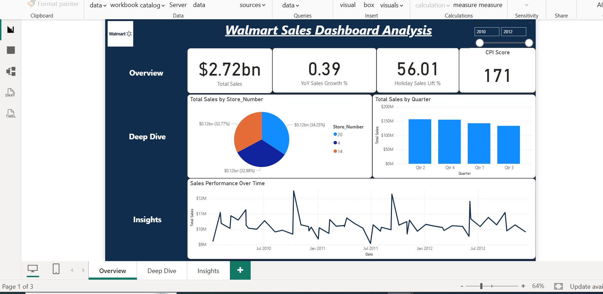
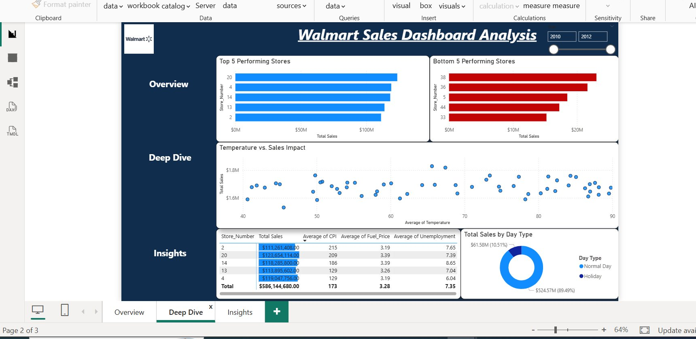
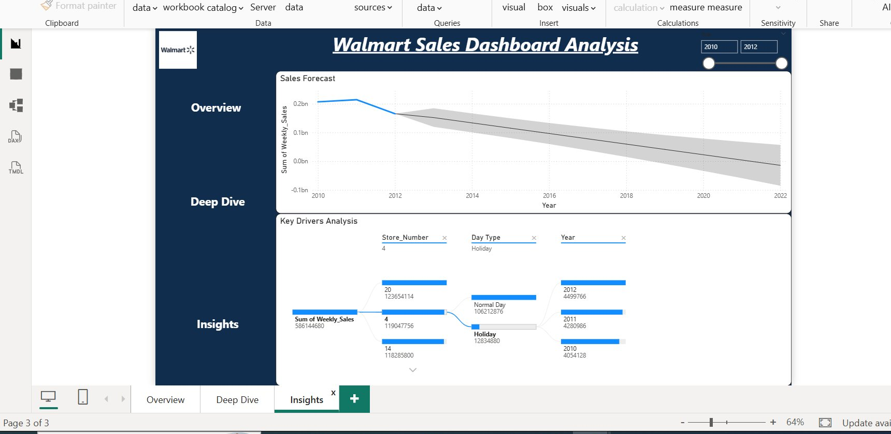
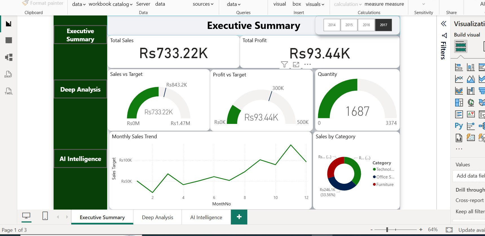
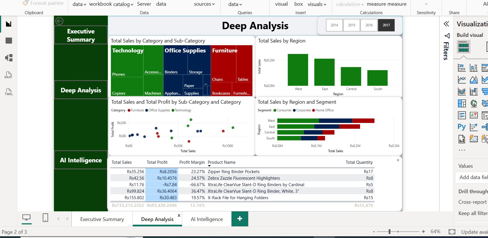
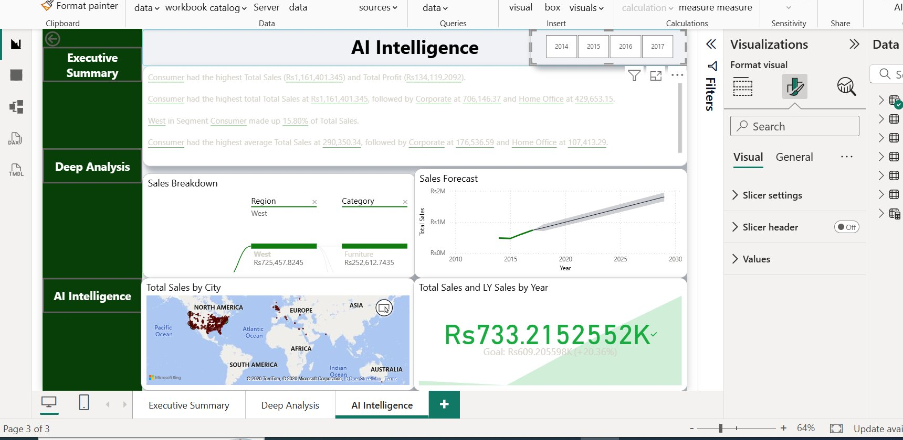

# 📊 Power BI Portfolio — Hassan Raza

[](https://www.linkedin.com/in/hassanraza110/)
[]()
[]()

> A collection of professional Power BI dashboards showcasing advanced DAX, Star Schema data modeling, AI visuals, and business intelligence storytelling.

---

## 🏆 Projects

---

### 1. 🏪 Walmart FBA Sales Dashboard
> **VizChamp University Competition — 1st Place Winner 🥇**

**Page 1 — Overview**


**Page 2 — Deep Dive**


**Page 3 — Insights**


**Overview:**
An end-to-end sales analytics dashboard built on Walmart FBA store data. Designed to uncover sales trends, forecast future performance, and identify key business drivers across stores, quarters, and time periods.

**Key Features:**
- 📈 Sales Forecasting with confidence intervals
- 🌡️ Temperature vs Sales correlation analysis
- 🔍 Key Drivers Analysis (Decomposition Tree)
- 📊 YoY Sales Growth & Holiday Sales Lift % measures
- 🏪 Top 5 vs Bottom 5 store performance comparison
- 📅 Dynamic date range slider filter
- 🔖 Bookmark navigation — Overview / Deep Dive / Insights

**DAX Measures:**
```dax
Total Sales = SUM('Fact'[Weekly_Sales])
YoY Sales Growth % = DIVIDE([Total Sales] - [LY Sales], [LY Sales])
Holiday Sales Lift % = DIVIDE([Holiday Sales] - [Regular Sales], [Regular Sales])
LY Sales = CALCULATE([Total Sales], SAMEPERIODLASTYEAR('Date'[Date]))
```

**Tools & Techniques:**
`Power BI` `Advanced DAX` `Sales Forecasting` `Decomposition Tree` `Bookmarks` `Cross-domain Correlation`

**📁 File:** [FBA_Project_Final_Dashboard.pbix](./FBA_Project_Final_Dashboard/FBA_Project_Final_Dashboard.pbix)

---

### 2. 🛒 Superstores Sales Dashboard
> **Advanced 3-Page Analytics Dashboard — Custom Grey Premium Theme**

**Page 1 — Executive Summary**


**Page 2 — Deep Analysis**


**Page 3 — AI Intelligence**


**Overview:**
A comprehensive 3-page sales intelligence dashboard built on the Superstore dataset featuring a custom dark grey premium theme, AI-powered visuals, Star Schema data model, and advanced DAX measures.

**Pages:**
| Page | Focus | Key Visuals |
|------|-------|-------------|
| 🎯 Executive Summary | KPIs & Trends | Cards, Gauges vs Target, Monthly Line, Donut |
| 🔍 Deep Analysis | Product & Customer | Treemap, Scatter, Stacked Bar, Conditional Table |
| 🤖 AI Intelligence | AI & Geography | Smart Narrative, Decomp Tree, Forecast, Map, KPI |

**Key Features:**
- ⚡ Custom Greyish Premium dark theme (JSON)
- 🎯 Gauge visuals — Actual vs Target (Sales, Profit, Orders)
- 🤖 Smart Narrative — AI auto-generated business insights
- 🌳 Decomposition Tree — drill down Sales → Region → Category
- 📍 Geographic profit health map — city-level bubble analysis
- 📊 Conditional formatting table — red/green profit indicators
- 📈 Sales Forecast with confidence bands
- 🔢 YoY Growth KPI with trend line

**DAX Measures:**
```dax
Total Sales = SUM('Fact tables'[Sales])
Profit Margin % = DIVIDE([Total Profit], [Total Sales], 0)
Avg Order Value = DIVIDE([Total Sales], [Total Orders])
LY Sales = CALCULATE([Total Sales], SAMEPERIODLASTYEAR(Calendar[Date]))
YoY Growth % = DIVIDE([Total Sales] - [LY Sales], [LY Sales])
State Contribution % = DIVIDE([Total Sales], CALCULATE([Total Sales], ALL('Dim-Location'[State])))
Above Avg City = IF([Total Sales] > AVERAGEX(ALL('Dim-Location'[City]),[Total Sales]), "Above Avg", "Below Avg")
```

**Data Model — Star Schema:**
```
                    Dim-Product
                        │
Dim-Customers ──── Fact tables ──── Dim-Location
                        │
                   Dim-Orders
                        │
                     Calendar
```

**Tools & Techniques:**
`Power BI` `Star Schema` `Advanced DAX` `Smart Narrative` `Decomposition Tree` `Custom Theme JSON` `KPI Visuals` `Geographic Analysis`

**📁 File:** [Superstores_Sales_Dashboard.pbix](./Superstores_Sales_Dashboard/Superstores_Sales_Dashboard.pbix)

---

## 🛠️ Skills Demonstrated

| Skill | Details |
|-------|---------|
| ⚡ Power BI Desktop | Report design, visual formatting, custom themes |
| 🧮 DAX | Measures, CALCULATE, SAMEPERIODLASTYEAR, RANKX, DIVIDE |
| 🗄️ Data Modeling | Star Schema — Fact + Dimension tables |
| 🤖 AI Visuals | Smart Narrative, Decomposition Tree, Forecasting |
| 📊 Visualization | Gauges, KPIs, Maps, Treemaps, Scatter plots |
| 📖 Storytelling | Multi-page narrative with business insights |

---

## 📁 Repository Structure

```
Power-BI-Portfolio/
│
├── FBA_Project_Final_Dashboard/
│   ├── FBA_Project_Final_Dashboard.pbix
│   ├── fba_overview.png
│   ├── fba_deepdive.png
│   └── fba_insights.png
│
├── Superstores_Sales_Dashboard/
│   ├── Superstores_Sales_Dashboard.pbix
│   ├── superstore_executive.png
│   ├── superstore_deep.png
│   └── superstore_ai.png
│
└── README.md

```

---

## 📬 Let's Connect

**Hassan Raza** — Power BI Developer & Data Analyst

[](https://www.linkedin.com/in/hassanraza110/)

> 💡 *New dashboards added regularly — watch this repo for updates!*
